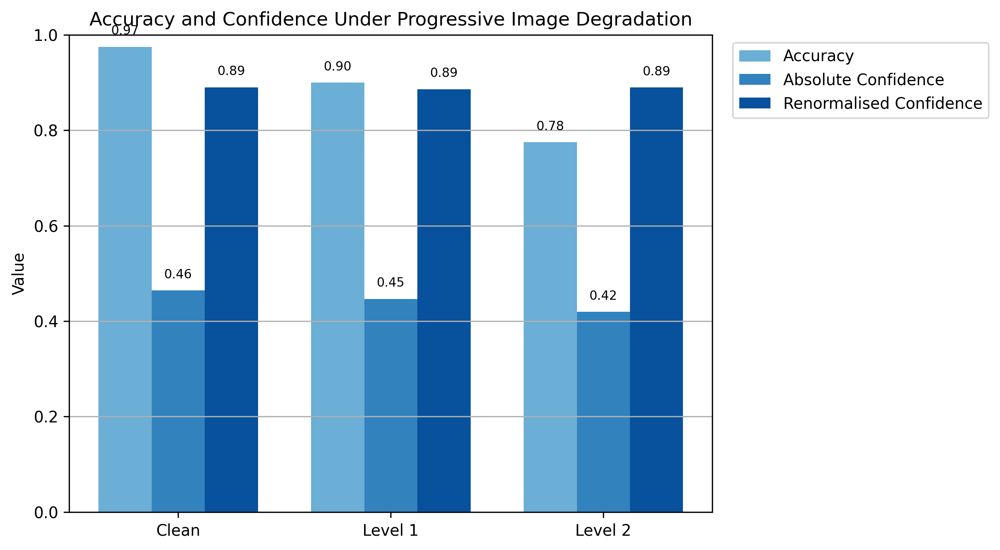
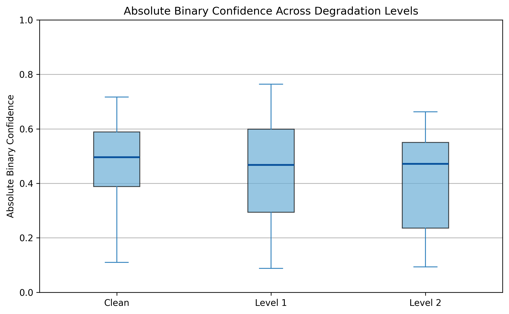

# CNN Decision Behaviour Under Image Degradation: A Grad-CAM Analysis
A structured evaluation of model behaviour under progressive image degradation.

## Overview

This project examines how a pretrained **ResNet50** behaves when image quality is progressively reduced.  

Using a fixed set of 40 Cat and Dog images, the model was evaluated under three conditions:

- Clean
- Level 1 degradation
- Level 2 degradation

The study analyses:

- Accuracy
- Binary confidence behaviour
- Probability mass distribution
- Grad-CAM attention shifts

---

## Dataset

The 40 fixed Cat/Dog images used in this experiment are available here:

🔗 **Google Drive Folder**  
https://drive.google.com/drive/folders/11lnY6zFUwwdgRqLKqPTmFVI_zSoSMXPc?usp=sharing

Download and upload into Colab before running the notebook.

---

## Methodology

- Used pretrained **ResNet50 (ImageNet weights)** with standard preprocessing.
- Defined binary probabilities as:

  - `dog_prob = Σ softmax(151–268)`
  - `cat_prob = Σ softmax(281–285)`

- Reported two confidence views:
  - **Absolute binary confidence**  
    `max(cat_prob, dog_prob)` (within 1000-class space)
  - **Renormalised confidence**  
    `max(cat_prob, dog_prob) / (cat_prob + dog_prob)` (Cat vs Dog only)

- Applied controlled degradations:
  - **Level 1:** 112×112 downsample to 224×224 upsample plus moderate Gaussian blur
  - **Level 2:** 64×64 downsample to 224×224 upsample plus stronger Gaussian blur

---

## Quantitative Results

### Accuracy and Confidence Across Degradation Levels

- **Accuracy:** 0.975 to 0.900 to 0.775  
- **Mean Absolute Binary Confidence:** 0.464 to 0.447 to 0.420  
- **Mean Cat/Dog Probability Mass:** 0.507 to 0.488 to 0.462  
- **Mean Renormalised Confidence:** 0.890 to 0.886 to 0.890  

Progressive degradation leads to reduced correctness and lower global certainty.  
However, when restricted to Cat vs Dog, the model remains strongly decisive.

---

### Absolute Confidence Distribution

The boxplot shows a downward shift in confidence distribution as degradation increases, with greater spread in Level 2.  

This indicates that degradation affects images unevenly — some remain stable, while others experience sharper confidence drops.

---

## Grad-CAM Attention Shift

### Clean vs Level 1 vs Level 2 (10 Examples)

Observations:

- **Clean:** Attention focuses on semantically meaningful regions (face, head, body).
- **Level 1:** Attention becomes broader and less precise.
- **Level 2:** Attention often shifts toward coarse shapes or background regions, particularly in misclassified cases.

As image detail decreases, the model relies increasingly on coarse structures and texture cues rather than fine semantic features.

---

## Key Interpretation

Image degradation does more than reduce accuracy.

It:

- Lowers global certainty
- Shifts probability mass toward unrelated classes
- Increases variability in confidence
- Alters spatial attention behaviour

Yet the internal Cat vs Dog separation remains relatively stable when viewed in isolation.

---

## Conclusion

This experiment demonstrates how progressive image degradation influences both prediction behaviour and internal attention mechanisms in a pretrained convolutional neural network.

It provides a compact, reproducible example of:

- Robustness analysis
- Behavioural evaluation under distribution shift
- Explainability-based inspection using Grad-CAM

---

## Author

Emmanuel Ekechukwu  

